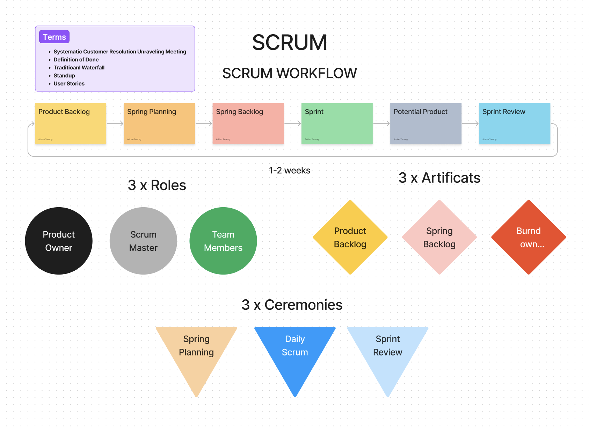
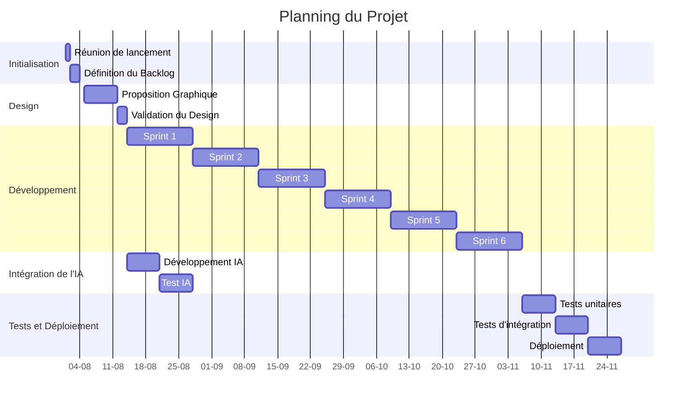

# Gestion de projet

## Méthodologie : SCRUM

Nous allons utiliser la méthodologie Agile SCRUM pour gérer ce projet. Cette approche permettra une collaboration étroite entre les membres de l'équipe et une adaptation rapide aux changements de besoins. Voici comment nous allons organiser les cérémonies SCRUM et gérer les backlogs.

## Organisation de l'équipe et Cérémonies SCRUM

## Détails de l'organisation :

1. **Product Owner (Antoine)** :
    - Priorisation du backlog produit.
    - Définition des exigences fonctionnelles.
    - Participation au sprint planning, sprint review et sprint retrospective.

2. **Graphiste (Paul)** :
    - Proposition graphique.
    - Collaboration avec Mathieu pour l'intégration du design.

3. **Développeur Principal (Mathieu)** :
    - Développement backend et frontend.
    - Gestion de la base de données SQL et NoSQL.
    - Participation à toutes les cérémonies SCRUM.

4. **IA Spécialiste (Michel)** :
    - Intégration de l'intelligence artificielle.
    - Développement et test des fonctionnalités IA.
    - Participation aux cérémonies SCRUM.

## Cérémonies SCRUM :

- **Sprint Planning** : Définition des tâches du sprint en fonction des priorités du Product Owner.
- **Daily Standup** : Réunion quotidienne pour suivre l'avancement des tâches et lever les obstacles.
- **Sprint Review** : Présentation des fonctionnalités développées à la fin du sprint.
- **Sprint Retrospective** : Analyse de ce qui a bien fonctionné et des points d'amélioration pour le prochain sprint.

## Planning et Suivi avec Kanban et Diagramme de Gantt

### Tableau Kanban

### Diagramme de Gantt

## Environnement humain

L'équipe se compose de quatre membres principaux, chacun ayant un rôle spécifique mais collaborant étroitement pour assurer le succès du projet.

- **Antoine (Product Owner)** : Responsable de la vision du produit et de la priorisation des tâches.
- **Paul (Graphiste)** : Crée les designs et collabore avec le développeur principal pour l'intégration.
- **Mathieu (Développeur Principal)** : Conduit le développement de l'application et assure l'intégration des différentes technologies.
- **Michel (IA Spécialiste)** : Responsable de l'intégration des fonctionnalités d'intelligence artificielle.

## Objectifs de qualité

Pour assurer la qualité du projet, nous mettons en place les objectifs suivants :

- **Satisfaction des utilisateurs** : Créer une plateforme intuitive et fonctionnelle.
- **Performance** : Optimiser les temps de réponse et la fluidité de l'application.
- **Sécurité** : Protéger les données des utilisateurs et garantir la conformité avec les normes de sécurité.
- **Maintenabilité** : Écrire un code propre et bien documenté pour faciliter les futures évolutions.
- **Tests rigoureux** : Effectuer des tests unitaires, d'intégration et de performance tout au long du projet.

En adoptant la méthodologie SCRUM et en suivant un planning structuré, nous visons à livrer une plateforme de cours en ligne de haute qualité, répondant aux besoins des utilisateurs tout en respectant les contraintes de temps et de ressources.