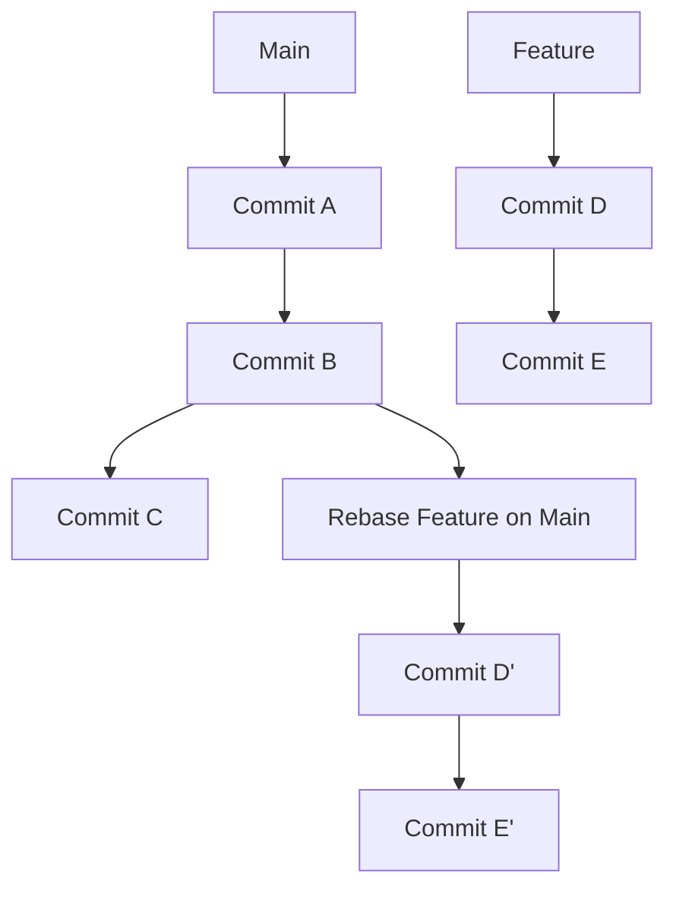
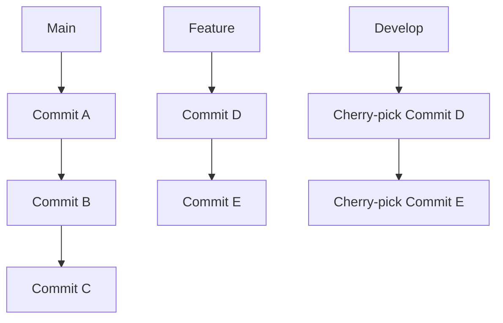

# Différences entre `git rebase` et `git cherry-pick`

Les commandes `git rebase` et `git cherry-pick` sont toutes deux utilisées pour réappliquer des commits, mais elles servent des objectifs différents et sont utilisées dans des contextes variés. Voici une explication détaillée de leurs différences, de leurs usages et des scénarios appropriés pour chacune.

## Objectifs et Fonctionnement

### 1. **git rebase**
- **Objectif** : Rejouer une série de commits sur une autre base. Principalement utilisé pour maintenir un historique linéaire et propre.
- **Fonctionnement** : Déplace (ou rejoue) les commits de la branche courante sur une nouvelle base (branche cible). Chaque commit est réappliqué dans l'ordre, créant de nouveaux commits avec de nouveaux SHA-1.
- **Usage typique** : Mettre à jour une branche de fonctionnalité avec les derniers changements de la branche `main` avant de l'intégrer.

### 2. **git cherry-pick**
- **Objectif** : Appliquer un ou plusieurs commits spécifiques d'une branche à une autre. Principalement utilisé pour porter des corrections ou des fonctionnalités individuelles entre branches.
- **Fonctionnement** : Applique les changements introduits par un commit spécifique à la branche courante, créant un nouveau commit avec un nouveau SHA-1.
- **Usage typique** : Récupérer un commit de correction de bug de la branche `hotfix` vers la branche `develop`.

## Différences Principales

### 1. **Contexte d'utilisation**
- `git rebase` est utilisé pour intégrer une branche dans une autre en réappliquant une série de commits, souvent pour garder un historique de commits linéaire.
- `git cherry-pick` est utilisé pour extraire des commits spécifiques d'une branche et les appliquer à une autre, sans réappliquer l'ensemble de la branche.

### 2. **Effet sur l'historique**
- `git rebase` réécrit l'historique de commits de la branche rebasée, créant de nouveaux commits et changeant les SHA-1 des commits rebasés.
- `git cherry-pick` n'affecte que les commits choisis, laissant le reste de l'historique inchangé.

### 3. **Complexité et Conflits**
- `git rebase` peut être plus complexe car il réapplique plusieurs commits, ce qui peut entraîner de multiples conflits à résoudre.
- `git cherry-pick` peut entraîner des conflits mais seulement pour les commits spécifiquement choisis.

## Scénarios d'utilisation

### 1. **Exemple de Rebase**
Vous avez travaillé sur une branche `feature` et souhaitez intégrer les derniers changements de `main` avant de fusionner.

```bash
$ git checkout feature
$ git rebase main
```

- **Scénario concret** : Vous avez une branche de fonctionnalité `feature-login` et la branche `main` a reçu plusieurs mises à jour importantes. Pour éviter des conflits lors de la fusion, vous décidez de rebaser votre branche `feature-login` sur `main`.

```bash
$ git checkout feature-login
$ git rebase main
```

### 2. **Exemple de Cherry-pick**
Vous avez corrigé un bug dans une branche `hotfix` et souhaitez appliquer cette correction à `develop` sans réintégrer toute la branche `hotfix`.

```bash
$ git checkout develop
$ git cherry-pick <sha1_du_commit>
```

- **Scénario concret** : Vous avez un correctif critique sur `hotfix` pour un bug bloquant, mais la branche `develop` continue à recevoir des fonctionnalités et des changements. Vous voulez appliquer ce correctif spécifique à `develop` sans affecter les autres commits de `hotfix`.

```bash
$ git checkout develop
$ git cherry-pick abc1234
```

## Illustration avec Mermaid

Voici un diagramme Mermaid pour visualiser les deux commandes :

### Rebase



### Cherry-pick



## Conclusion

En résumé, `git rebase` et `git cherry-pick` sont des outils puissants pour gérer l'historique de vos projets Git. Utilisez `rebase` pour maintenir un historique linéaire et pour intégrer des branches entières, tandis que `cherry-pick` est idéal pour appliquer des commits spécifiques entre branches. Comprendre les différences et les implications de chaque commande vous aidera à choisir la méthode appropriée pour vos besoins de gestion de version.