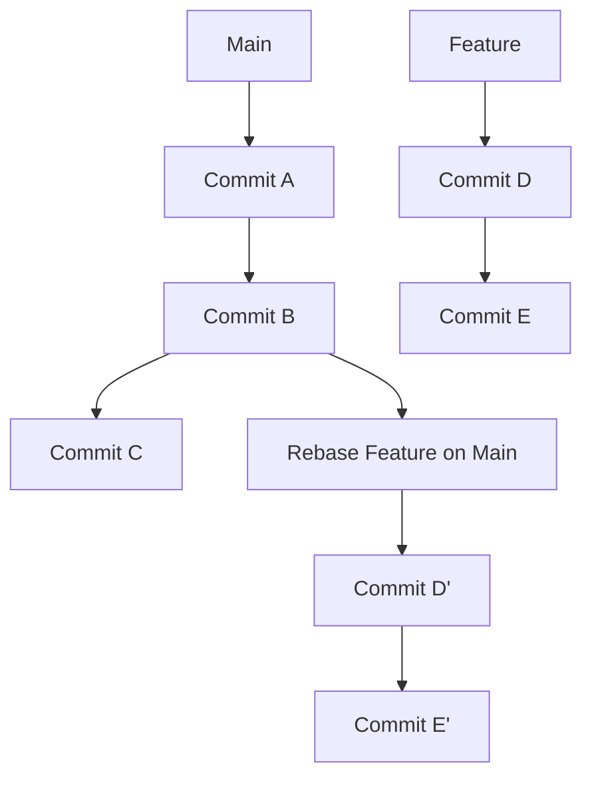

# Scénario Complet de `git rebase`

## Contexte

Vous travaillez sur un projet avec les branches suivantes :
- `main` : la branche principale du projet.
- `feature` : une branche de fonctionnalité sur laquelle vous travaillez actuellement.

Vous souhaitez intégrer les derniers changements de la branche `main` dans votre branche `feature` afin de garantir que votre branche de fonctionnalité est à jour avant de la fusionner dans `main`.

## Étapes à Suivre

1. **Préparer le Rebase**

Commencez par vérifier l'état de votre branche de fonctionnalité et vous assurer que vous avez commis toutes vos modifications en cours.

```bash
$ git status
```

Ensuite, assurez-vous d'être sur la branche `feature`.

```bash
$ git checkout feature
```

2. **Rebaser la Branche `feature` sur `main`**

Lancez le rebase pour appliquer les commits de `feature` par-dessus les derniers commits de `main`.

```bash
$ git rebase main
```

3. **Résolution des Conflits**

Si des conflits surviennent pendant le rebase, Git vous en informera et vous devrez les résoudre manuellement.

```bash
$ git status
# Montre les fichiers en conflit
$ git mergetool
# Utilisez votre outil de fusion préféré pour résoudre les conflits
```

Après avoir résolu les conflits, marquez-les comme résolus et continuez le rebase.

```bash
$ git add <fichier_conflit>
$ git rebase --continue
```

Si vous souhaitez annuler le rebase à tout moment, vous pouvez utiliser la commande suivante :

```bash
$ git rebase --abort
```

4. **Finaliser le Rebase**

Une fois le rebase terminé, vérifiez l'historique des commits pour vous assurer que tout s'est déroulé correctement.

```bash
$ git log
```

5. **Tester et Pousser les Changements**

Après le rebase, testez votre code pour vous assurer que tout fonctionne correctement.

```bash
$ ./run_tests.sh
```

Ensuite, poussez les changements vers le dépôt distant. Si votre rebase a modifié l'historique de la branche partagée, vous devrez forcer le push.

```bash
$ git push origin feature --force
```

## Exemple Concret avec Code

Voici un exemple concret de l'ensemble du processus, avec des commandes Git :

```bash
# Assurez-vous d'avoir commis toutes vos modifications en cours
$ git status

# Passez sur la branche feature
$ git checkout feature

# Rebase la branche feature sur main
$ git rebase main

# Résolvez les conflits s'il y en a
$ git status
$ git mergetool
$ git add <fichier_conflit>
$ git rebase --continue

# Si nécessaire, annulez le rebase
$ git rebase --abort

# Vérifiez l'historique des commits
$ git log

# Testez le code
$ ./run_tests.sh

# Poussez les changements vers le dépôt distant
$ git push origin feature --force
```

## Illustration avec Diagramme

Voici un diagramme Mermaid pour visualiser le processus de rebase :



## Bonnes Pratiques

1. **Sauvegarder Votre Travail** : Avant de rebaser, assurez-vous d'avoir sauvegardé votre travail. Utilisez `git stash` si vous avez des modifications non commises.

2. **Utiliser des Branches de Travail** : Pour éviter de compromettre les branches principales, utilisez des branches de travail pour expérimenter et tester les rebases.

3. **Communiquer avec l'Équipe** : Si vous travaillez en équipe, informez les membres de l'équipe avant de réécrire l'historique partagé et utilisez `git push --force` avec précaution.

4. **Tester Après le Rebase** : Testez toujours votre code après un rebase pour vous assurer que tout fonctionne correctement et qu'aucun bug n'a été introduit.

## Conclusion

`git rebase` est un outil puissant pour maintenir un historique de commits linéaire et propre. Il est particulièrement utile pour intégrer les dernières modifications d'une branche principale dans une branche de fonctionnalité avant la fusion. En comprenant et en maîtrisant `git rebase`, vous pouvez gérer efficacement les versions de votre projet et collaborer plus efficacement avec votre équipe.