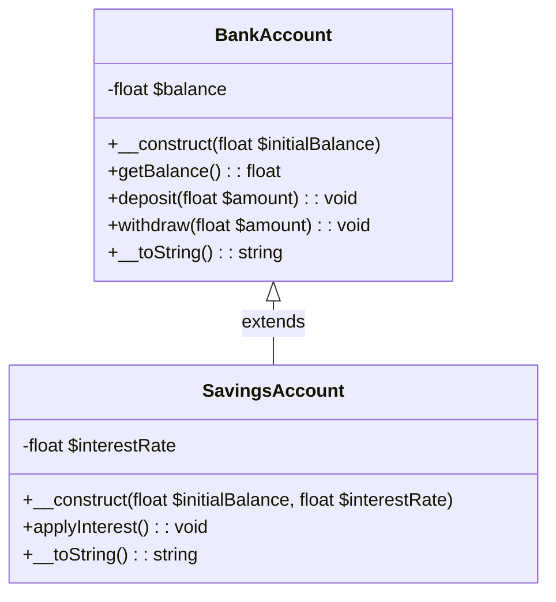
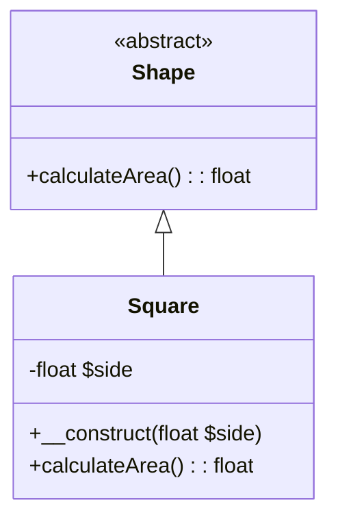
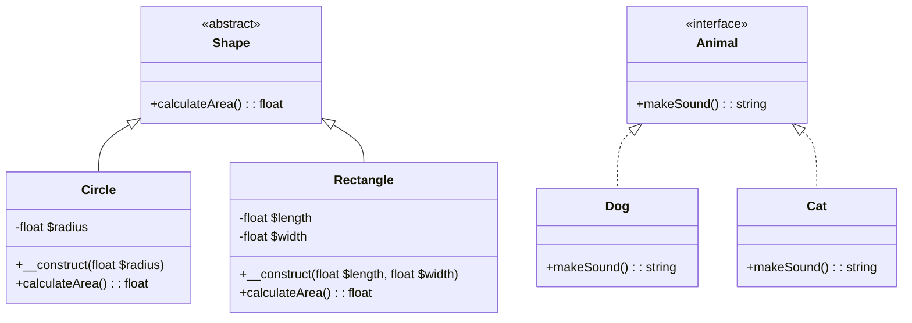
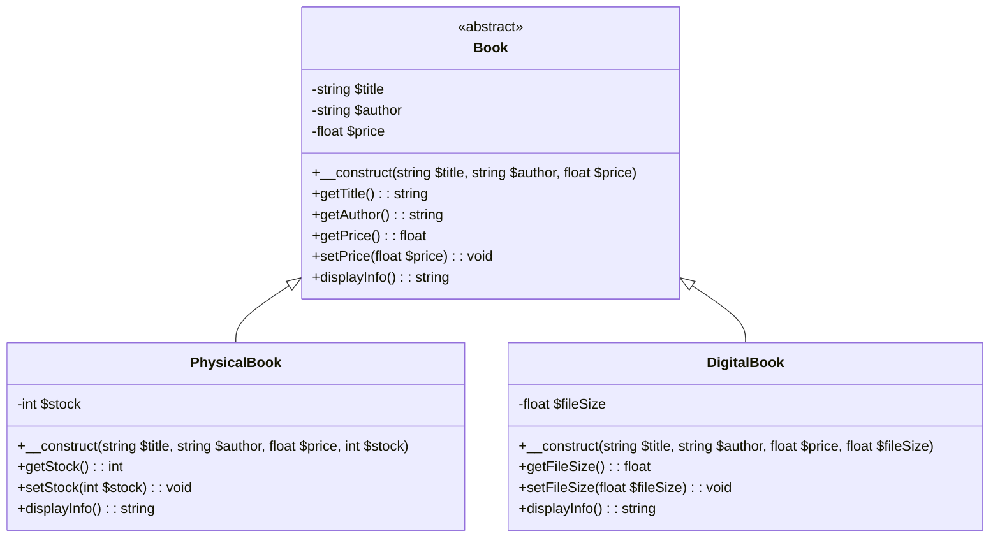

# Introduction à la Programmation Orientée Objet (POO) en PHP

## 1. Qu'est-ce que la Programmation Orientée Objet (POO) ?

**Définition :**
La Programmation Orientée Objet (POO) est un paradigme de programmation qui utilise des objets et des classes pour structurer le code de manière modulaire et réutilisable.

**Avantages de la POO :**
- **Modularité :** Facilite la gestion et la maintenance du code en divisant les fonctionnalités en modules indépendants.
- **Réutilisabilité :** Permet de réutiliser les classes et les objets dans différents programmes.
- **Maintenabilité :** Simplifie les modifications et les extensions du code existant.
- **Encapsulation :** Protège les données et les méthodes à l'intérieur des objets.
- **Héritage :** Favorise la création de nouvelles classes basées sur des classes existantes.
- **Polymorphisme :** Permet de traiter des objets de classes différentes de manière uniforme.

## 2. Les Concepts Fondamentaux de la POO

### 2.1 Classes et Objets

**Définition :**
- **Classe :** Modèle définissant les propriétés (attributs) et les comportements (méthodes) des objets.
- **Objet :** Instance d'une classe contenant des valeurs spécifiques pour les attributs et des implémentations des méthodes.

```php
<?php
class Car {
    // Attributs
    public string $brand;
    public string $color;

    // Constructeur
    public function __construct(string $brand, string $color) {
        $this->brand = $brand;
        $this->color = $color;
    }

    // Méthodes
    public function start() : string {
        return "The car starts\n";
    }

    public function __toString() : string {
        return "Brand: $this->brand, Color: $this->color\n";
    }
}

// Création d'un objet
$jogger = new Car("Renault", "Blue");
$jogger->start();
echo $jogger ; // déclenche la méthode magique __toString
```

### 2.2 Encapsulation

L'encapsulation est un des principes fondamentaux de la programmation orientée objet (POO). 

En PHP, comme dans d'autres langages de programmation orientée objet, l'encapsulation consiste à regrouper les données (attributs) et les méthodes (fonctions) qui manipulent ces données au sein d'une même classe, tout en contrôlant l'accès à ces données.

### Principe de base
- **Protection des données** : L'encapsulation permet de protéger les données de l'objet contre les accès et modifications non contrôlés depuis l'extérieur de la classe. Cela se fait en définissant la **visibilité** des attributs et méthodes avec des mots-clés comme `private`, `protected`, et `public`.
  - **private** : L'attribut ou la méthode est accessible uniquement à l'intérieur de la classe où il est défini.
  - **protected** : L'attribut ou la méthode est accessible à l'intérieur de la classe et des classes héritées (sous-classes).
  - **public** : L'attribut ou la méthode est accessible depuis n'importe où, y compris de l'extérieur de la classe.

La classe `BankAccount` représente un compte bancaire avec un solde, l'attribut `$balance` n'est pas accessible au script courant. L'accès à cet variable de classe se fera par les `mutateurs` ou `setter` en anglais et les `accesseurs` ou `getter` en anglais.

L'intérêt d'utiliser les getters et les setters est que l'on peut effectuer certains contrôles avant l'enregistrement des valeurs dans la classe et il est toujours possible de récupérer les valeurs via le `getter`. 

Considérez l'exemple : 

```php
<?php
class BankAccount {
    private float $balance;

    public function __construct($initialBalance) {
        $this->balance = $initialBalance;
    }

    // Accesseur ou setter
    public function getBalance():float {
        return $this->balance;
    }

    // Mutateur ou getter
    public function deposit(float $amount): void {
        if ($amount > 0) {
            $this->balance += $amount;
        }
    }

    public function withdraw(float $amount): void {
        if ($amount > 0 && $amount <= $this->balance) {
            $this->balance -= $amount;
        }
    }

    // Méthode privée pour vérifier un solde élevé
    private function checkForHighBalance(): void {
        if ($this->balance > 100000) {
            echo "Alerte: Solde élevé! Considérez d'investir ou de consulter un conseiller financier.";
        }
    }

    // méthode magique 
    public function __toString() : string {
        return "Balance: " . round($this->balance, 2);
    }

}

// Utilisation avec getter et setter
$account = new BankAccount(1000.00);
$account->deposit(500.50);
$account->withdraw(300.25);

echo $account;

// il est par contre impossible d'accéder directement aux attributs private ou protected
// PHP Error:  Cannot access private property BankAccount::$balance 
// $account->balance; 
```

- **Attribut privé** : L'attribut `$balance` est défini comme `private`, ce qui signifie qu'il n'est pas accessible directement depuis l'extérieur de la classe. Cela protège le solde du compte contre les modifications non autorisées.
- **Méthodes publiques** : Les méthodes `getBalance`, `deposit`, et `withdraw` sont définies comme `public`, ce qui permet de les appeler depuis l'extérieur de la classe pour obtenir, déposer, ou retirer de l'argent du compte.
- **Méthode privée** : La méthode `checkForHighBalance` est définie comme `private`, ce qui signifie qu'elle ne peut être appelée qu'à l'intérieur de la classe `BankAccount`. Cette méthode vérifie si le solde dépasse un certain seuil et affiche un message d'alerte si nécessaire.

L'encapsulation, en regroupant les données et les méthodes et en contrôlant l'accès aux données, contribue à la robustesse et à la maintenabilité du code. 

Les données sont protégées contre les modifications non contrôlées et les méthodes internes peuvent être modifiées sans affecter le code qui utilise la classe.

### 2.3 Héritage

**Définition :**
L'héritage permet à une classe de dériver d'une autre classe, héritant ainsi de ses attributs et méthodes tout en pouvant les étendre ou les modifier, et facilite la maintenance.

L'héritage permet de modéliser des relations "est-un" entre les classes, où la classe fille "est un type de" la classe parente, tout en permettant à la classe fille d'ajouter des comportements ou des propriétés supplémentaires spécifiques à son type.

L'héritage est un autre principe fondamental de la programmation orientée objet (POO). Il permet de créer une nouvelle classe à partir d'une classe existante.

1. **Classe Parent (Base)** : La classe existante dont une nouvelle classe va hériter.
2. **Classe Enfant (Dérivée)** : La nouvelle classe qui hérite des attributs et méthodes de la classe parent.
3. **Réutilisation du Code** : La classe enfant peut utiliser (hériter) les fonctionnalités de la classe parent et y ajouter ou modifier des fonctionnalités.

Supposons que nous avons une classe de base `BankAccount`, déjà connu, et nous voulons créer une classe dérivée `SavingsAccount` qui hérite de `BankAccount` et ajoute une fonctionnalité spécifique à un compte d'épargne, comme l'application d'un taux d'intérêt.

#### Classe Dérivée : SavingsAccount

```php
<?php
class SavingsAccount extends BankAccount {
    private float $interestRate;

    public function __construct(float $initialBalance, float $interestRate) {
        // Appel du constructeur de la classe parent
        parent::__construct($initialBalance);
        $this->interestRate = $interestRate;
    }

    public function applyInterest(): void {
        $balance = $this->getBalance();
        $interest = $balance * $this->interestRate / 100;
        $this->deposit($interest);
    }

    public function __toString(): string {
        return parent::__toString() . ", Interest Rate: " . $this->interestRate . "%";
    }
}

// Création d'un objet de la classe SavingsAccount
$compteEpargne = new SavingsAccount(5000.00, 1.5);
echo $compteEpargne; // Affiche le solde et le taux d'intérêt

// Application des intérêts
$compteEpargne->applyInterest();
echo $compteEpargne; // Affiche le nouveau solde après application des intérêts
?>
```

### Diagramme de classe, diagramme UML (Unified Modeling Language)



`BankAccount` est la classe de base avec des attributs et des méthodes publics et privés.
`SavingsAccount` est la classe dérivée qui étend BankAccount.

- La flèche --> indique que SavingsAccount hérite de BankAccount.
- Les symboles - et + représentent respectivement les membres privés et publics de la classe.

Détaillons des points importants.

- **Héritage de la classe parent** : `SavingsAccount` utilise le mot-clé `extends` pour hériter de `BankAccount`. Cela signifie que `SavingsAccount` possède tous les attributs et méthodes de `BankAccount`.
  
- **Constructeur de la classe enfant** : Le constructeur de `SavingsAccount` appelle le constructeur de `BankAccount` avec `parent::__construct($initialBalance)`, ce qui permet d'initialiser correctement l'objet parent.
  
- **Ajout de nouvelles fonctionnalités** : `SavingsAccount` ajoute une nouvelle propriété `$interestRate` et une nouvelle méthode `applyInterest` pour appliquer des intérêts au solde du compte.
  
- **Redéfinition de la méthode `__toString`** : La méthode `__toString` est redéfinie dans `SavingsAccount` pour inclure le taux d'intérêt en plus du solde.

- **Réutilisation du Code** : L'héritage permet de réutiliser le code existant, ce qui réduit les redondances.
  
- **Extensibilité** : Les classes dérivées peuvent étendre les fonctionnalités des classes parent sans modifier le code existant.
  
- **Polymorphisme** : L'héritage permet d'utiliser le polymorphisme, où un objet de la classe dérivée peut être traité comme un objet de la classe parent. On revoit cette notion plus loin de manière détaillée.

### 2.4 Abstraction

**Définition :**
L'abstraction consiste à créer des classes abstraites qui ne peuvent pas être instanciées directement et qui contiennent des méthodes abstraites devant être implémentées par les classes dérivées.

Les classes abstraites permettent de définir des modèles généraux qui peuvent être partagés entre plusieurs classes dérivées. 

Elles encapsulent les aspects communs d'un ensemble de classes et définissent une interface commune pour ces classes. Cela favorise la réutilisation du code et maintient une cohérence dans la conception.

```php
<?php
abstract class Shape {
    // Méthode abstraite sans implémentation
    abstract public function calculateArea();
}

class Square extends Shape {
    private $side;

    public function __construct($side) {
        $this->side = $side;
    }

    // Implémentation de la méthode abstraite
    public function calculateArea() {
        return $this->side * $this->side;
    }
}

// Utilisation
$mySquare = new Square(5);
echo "Area of the square: " . $mySquare->calculateArea() . "\n";
?>
```

- **Classe Abstraite `Shape`** :
  - Contient une méthode abstraite `calculateArea()` sans implémentation.
  - Ne peut pas être instanciée directement.
- **Classe Concrète `Square`** :
  - Hérite de `Shape`.
  - Implémente la méthode abstraite `calculateArea()`.
- **Utilisation** :
  - Création d'une instance de `Square` et appel de `calculateArea()`.

### Diagramme de classe, diagramme UML

Pour visualiser ces concepts, voici le diagramme UML correspondant :



- **Classe Abstraite `Shape`** :
  - Marquée avec `<<abstract>>` pour indiquer qu'il s'agit d'une classe abstraite.
  - Contient une méthode abstraite `calculateArea()`.

- **Classe `Square`** :
  - Hérite de la classe `Shape`.
  - Implemente la méthode `calculateArea()` définie dans `Shape`.
  - A un attribut privé `$side` et un constructeur.

- **Relation d'Héritage** :
  - La flèche `Shape <|-- Square` indique que `Square` hérite de `Shape`.

Ton cours sur le polymorphisme est bien structuré et couvre les concepts fondamentaux. Voici quelques suggestions pour le rendre encore plus complet et clair :

### 2.5 Polymorphisme

**Définition :**
Le polymorphisme permet d'utiliser des objets de différentes classes de manière interchangeable grâce à une interface ou une classe de base commune.

### Utilisation des Classes Abstraites

Les classes abstraites facilitent l'utilisation du polymorphisme, où des objets de types différents peuvent être manipulés de manière uniforme via leur classe abstraite commune. Cela permet de traiter des objets de différentes classes de manière générique, en utilisant des méthodes définies dans la classe abstraite.

Imaginons une classe abstraite `Shape` avec une méthode abstraite `calculateArea()` :

```php
abstract class Shape {
    abstract public function calculateArea(): float;
}

class Circle extends Shape {
    private float $radius;

    public function __construct(float $radius) {
        $this->radius = $radius;
    }

    public function calculateArea(): float {
        return pi() * $this->radius * $this->radius;
    }
}

class Rectangle extends Shape {
    private float $length;
    private float $width;

    public function __construct(float $length, float $width) {
        $this->length = $length;
        $this->width = $width;
    }

    public function calculateArea(): float {
        return $this->length * $this->width;
    }
}
```

#### Utilisation des Interfaces

En PHP, une interface est une structure **contractuelle** qui définit les méthodes qu'une classe doit implémenter. Elle ne contient aucune implémentation de méthodes, seulement leurs signatures.

```php
interface Animal {
    public function makeSound(): string;
}
```

##### Contrats et Méthodes Définies par les Interfaces

Les interfaces définissent un contrat que les classes doivent suivre. Toute classe qui implémente une interface **doit fournir une implémentation** de toutes les méthodes définies par cette interface.

### Polymorphisme avec les Interfaces

En utilisant des interfaces, vous pouvez traiter des objets de différentes classes de manière polymorphe. Cela signifie que vous pouvez appeler la même méthode sur des objets différents et obtenir des comportements spécifiques à chaque classe.

```php
interface Animal {
    public function makeSound(): string;
}

class Dog implements Animal {
    public function makeSound(): string {
        return "Bark!";
    }
}

class Cat implements Animal {
    public function makeSound(): string {
        return "Meow!";
    }
}

// Utilisation polymorphe
function animalMakeSound(Animal $animal): string {
    return $animal->makeSound();
}

$dog = new Dog();
$cat = new Cat();

echo animalMakeSound($dog); // Output: Bark!
echo animalMakeSound($cat); // Output: Meow!
```

### Avantages du Polymorphisme avec les Interfaces

1. **Flexibilité et Modularité du Code** :
   Le polymorphisme avec les interfaces permet de concevoir des systèmes flexibles où les objets peuvent être remplacés ou étendus facilement sans affecter le reste du système.

2. **Réutilisation du Code et Facilité de Maintenance** :
   Les interfaces permettent une réutilisation efficace du code en définissant des contrats clairs et en isolant les détails d'implémentation. Cela facilite également la maintenance du code en réduisant les dépendances et en permettant des modifications ciblées.

3. **Conformité aux Principes de Conception SOLID** :
   En suivant les principes de conception SOLID, notamment l'interface de ségrégation et l'ouverture/fermeture, le polymorphisme avec les interfaces favorise une architecture logicielle robuste et évolutive.

### Diagramme UML pour le Polymorphisme

Pour mieux illustrer le polymorphisme avec des classes abstraites et des interfaces, voici un diagramme UML :



### Explications des Notations Utilisées

- **Classe Abstraite `Shape`** :
  - Représentée avec `<<abstract>>`.
  - Méthode abstraite `calculateArea()`.

- **Classes `Circle` et `Rectangle`** :
  - Héritent de `Shape` et implémentent `calculateArea()`.

- **Interface `Animal`** :
  - Représentée avec `<<interface>>`.
  - Méthode `makeSound()`.

- **Classes `Dog` et `Cat`** :
  - Implémentent l'interface `Animal`.

Ce diagramme UML montre clairement les relations d'héritage et d'implémentation, illustrant comment le polymorphisme permet de traiter des objets de manière uniforme.

## Exercice : Gestion d'une Bibliothèque

Dans cet exercice, nous allons créer un système simple de gestion d'une bibliothèque en utilisant les concepts de l'encapsulation, de l'héritage et de l'abstraction.

## Contexte

Nous avons plusieurs types de livres dans notre bibliothèque : des livres physiques et des livres numériques. Chaque type de livre doit avoir des attributs et des méthodes spécifiques. Nous allons utiliser les principes de la programmation orientée objet pour structurer notre code.

## Instructions

1. **Créer une classe abstraite `Book`** qui contient les attributs et méthodes communs à tous les types de livres.
2. **Créer deux classes dérivées** : `PhysicalBook` et `DigitalBook` qui hériteront de la classe `Book`.
3. **Utiliser l'encapsulation** pour protéger les attributs des classes.
4. **Utiliser l'héritage** pour partager le code commun entre les classes.
5. **Utiliser l'abstraction** pour définir des méthodes que chaque classe dérivée doit implémenter.

### Diagramme UML

Pour représenter ces classes et leurs relations, voici le diagramme UML :


