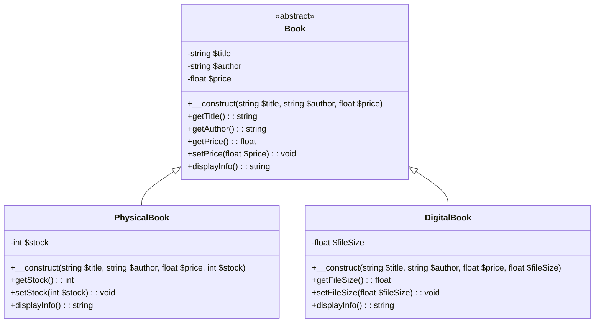

# Exercice : Gestion d'une Bibliothèque

Dans cet exercice, nous allons créer un système simple de gestion d'une bibliothèque en utilisant les concepts de l'encapsulation, de l'héritage et de l'abstraction.

## Contexte

Nous avons plusieurs types de livres dans notre bibliothèque : des livres physiques et des livres numériques. Chaque type de livre doit avoir des attributs et des méthodes spécifiques. Nous allons utiliser les principes de la programmation orientée objet pour structurer notre code.

## Instructions

1. **Créer une classe abstraite `Book`** qui contient les attributs et méthodes communs à tous les types de livres.
2. **Créer deux classes dérivées** : `PhysicalBook` et `DigitalBook` qui hériteront de la classe `Book`.
3. **Utiliser l'encapsulation** pour protéger les attributs des classes.
4. **Utiliser l'héritage** pour partager le code commun entre les classes.
5. **Utiliser l'abstraction** pour définir des méthodes que chaque classe dérivée doit implémenter.

### Exemple de Code PHP

## 1. Classe Abstraite `Book`

```php
<?php
abstract class Book {
    // Attributs protégés
    protected string $title;
    protected string $author;
    protected float $price;

    // Constructeur
    public function __construct(string $title, string $author, float $price) {
        $this->title = $title;
        $this->author = $author;
        $this->price = $price;
    }

    // Méthode abstraite pour afficher les informations du livre
    abstract public function displayInfo(): string;

    // Accesseurs et mutateurs
    public function getTitle(): string {
        return $this->title;
    }

    public function getAuthor(): string {
        return $this->author;
    }

    public function getPrice(): float {
        return $this->price;
    }

    public function setPrice(float $price): void {
        if ($price > 0) {
            $this->price = $price;
        }
    }
}
?>
```

## 2. Classe Dérivée `PhysicalBook`

```php
<?php
class PhysicalBook extends Book {
    private int $stock;

    public function __construct(string $title, string $author, float $price, int $stock) {
        parent::__construct($title, $author, $price);
        $this->stock = $stock;
    }

    // Implémentation de la méthode abstraite
    public function displayInfo(): string {
        return "Title: $this->title, Author: $this->author, Price: $this->price, Stock: $this->stock";
    }

    public function getStock(): int {
        return $this->stock;
    }

    public function setStock(int $stock): void {
        if ($stock >= 0) {
            $this->stock = $stock;
        }
    }
}
?>
```

## 3. Classe Dérivée `DigitalBook`

```php
<?php
class DigitalBook extends Book {
    private float $fileSize;

    public function __construct(string $title, string $author, float $price, float $fileSize) {
        parent::__construct($title, $author, $price);
        $this->fileSize = $fileSize;
    }

    // Implémentation de la méthode abstraite
    public function displayInfo(): string {
        return "Title: $this->title, Author: $this->author, Price: $this->price, File Size: $this->fileSize MB";
    }

    public function getFileSize(): float {
        return $this->fileSize;
    }

    public function setFileSize(float $fileSize): void {
        if ($fileSize > 0) {
            $this->fileSize = $fileSize;
        }
    }
}
?>
```

## 4. Utilisation des Classes

```php
<?php
// Création d'un livre physique
$physicalBook = new PhysicalBook("1984", "George Orwell", 15.99, 10);
echo $physicalBook->displayInfo() . "\n"; // Affiche les informations du livre physique

// Création d'un livre numérique
$digitalBook = new DigitalBook("Brave New World", "Aldous Huxley", 9.99, 2.5);
echo $digitalBook->displayInfo() . "\n"; // Affiche les informations du livre numérique
?>
```

### Diagramme UML

Pour représenter ces classes et leurs relations, voici le diagramme UML :

