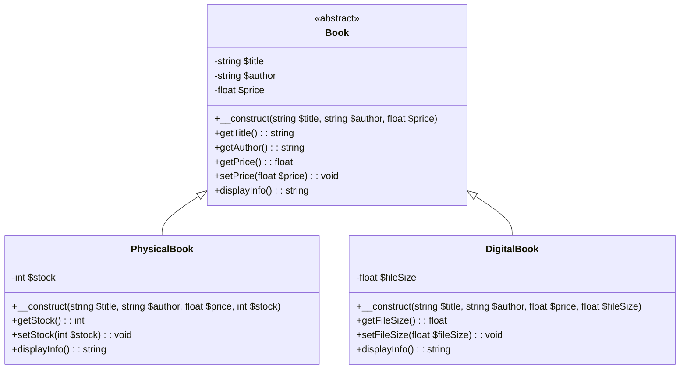

# Exercice : Gestion d'une Bibliothèque

Dans cet exercice, nous allons créer un système simple de gestion d'une bibliothèque en utilisant les concepts de l'encapsulation, de l'héritage et de l'abstraction.

## Contexte

Nous avons plusieurs types de livres dans notre bibliothèque : des livres physiques et des livres numériques. Chaque type de livre doit avoir des attributs et des méthodes spécifiques. Nous allons utiliser les principes de la programmation orientée objet pour structurer notre code.

## Instructions

1. **Créer une classe abstraite `Book`** qui contient les attributs et méthodes communs à tous les types de livres.
2. **Créer deux classes dérivées** : `PhysicalBook` et `DigitalBook` qui hériteront de la classe `Book`.
3. **Utiliser l'encapsulation** pour protéger les attributs des classes.
4. **Utiliser l'héritage** pour partager le code commun entre les classes.
5. **Utiliser l'abstraction** pour définir des méthodes que chaque classe dérivée doit implémenter.

### Diagramme UML

Pour représenter ces classes et leurs relations, voici le diagramme UML :

